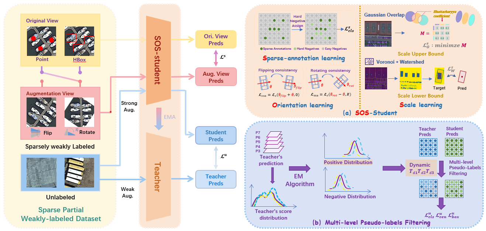

### SPWOOD: Sparse Partial Weakly-Supervised Oriented Object Detection[https://arxiv.org/abs/2602.03634]



## Abstract

A consistent trend throughout the research of oriented object detection has been the pursuit of maintaining comparable performance with fewer and weaker annotations. This is particularly crucial in the remote sensing domain, where the dense object distribution and a wide variety of categories contribute to prohibitively high costs. Based on the supervision level, existing oriented object detection algorithms can be broadly grouped into fully supervised, semi-supervised, and weakly supervised methods. Within the scope of this work, we further categorize them to include sparsely supervised and partially weakly-supervised methods. To address the challenges of large-scale labeling, we introduce the first Sparse Partial Weakly-Supervised Oriented Object Detection framework, designed to efficiently leverage only a few sparse weakly-labeled data and plenty of unlabeled data. Our framework incorporates three key innovations: (1) We design a Sparse-annotation-Orientation-and-Scale-aware Student (SOS-Student) model to separate unlabeled objects from the background in a sparsely-labeled setting, and learn orientation and scale information from orientation-agnostic or scale-agnostic weak annotations. (2) We construct a novel Multi-level Pseudo-label Filtering strategy that leverages the distribution of model predictions, which is informed by the model's multi-layer predictions. (3) We propose a unique sparse partitioning approach, ensuring equal treatment for each category. Extensive experiments on the DOTA and DIOR datasets show that our framework achieves a significant performance gain over traditional oriented object detection methods mentioned above, offering a highly cost-effective solution.

## Preparation

### Installation

```shell
conda create -n SPWOOD python==3.8 -y
conda activate SPWOOD
pip install torch==1.13.1+cu116 torchvision==0.14.1+cu116 torchaudio==0.13.1 --extra-index-url https://download.pytorch.org/whl/cu116
pip install -U openmim
mim install mmcv-full
mim install mmdet\<3.0.0

git clone https://github.com/VisionXLab/SPWOOD.git
cd SPWOOD

cd mmdetection
pip install -v -e .

cd ../mmrotate
pip install -v -e .
```

### Data preparation

For spliting the DOTA dataset via the released data list, please refer to [tools](https://github.com/VisionXLab/SPWOOD/tools)

The example of data setting:

```
/workspace/DOTA/v10/
├── semi_ratio_10
│   ├── sparse_ratio_10
│   │    ├── label_annotation
│   │    ├── label_image
│   │    ├── unlabel_annotation
│   │    └── unlabel_image
│   ├── sparse_ratio_20
│   │    ├── label_annotation
│   │    ├── label_image
│   │    ├── unlabel_annotation
│   │    └── unlabel_image
│   └── sparse_ratio_30
│        ├── label_annotation
│        ├── label_image
│        ├── unlabel_annotation
│        └── unlabel_image
├── semi_ratio_20
│   ├── ...  
│   ├── ...   
│   └── ...
└── semi_ratio_30
    ├── ...   
    ├── ...  
    └── ...

```

### Train

```shell
CUDA_VISIBLE_DEVICES=0,1 python -m torch.distributed.launch --nnodes=1 \
--node_rank=0 --master_addr="127.0.0.1" --nproc_per_node=2 --master_port=25500 \
train.py configs/......py \
--launcher pytorch \
--work-dir xxx
```


## Citation
```bibtex
@article{zhang2026spwood,
  title={SPWOOD: Sparse Partial Weakly-Supervised Oriented Object Detection},
  author={Zhang, Wei and Liu, Xiang and Liu, Ningjing and Liu, Mingxin and Liao, Wei and Xu, Chunyan and Yang, Xue},
  journal={arXiv preprint arXiv:2602.03634},
  year={2026}
}
```
